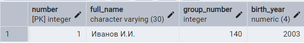

**Цель работы:**  получить теоретические знания по операторам выборки, запросам к связанным таблицам, подзапроса. Разработать запросы на языке SQL в соответствии с вариантом задания.

# Теоретическая часть

## Выборка данных из нескольких таблиц

Для выбора данных из нескольких таблиц необходимо перечислить имена требуемых таблиц в предложении `FROM` через запятую. В этом случае получим декартово произведение таблиц.

```SQL
SELECT * 
	FROM student, subject 
```


**Существует два способа соединения таблиц:**

1. Условие соединения указывается в предложении `WHERE`.

   **Пример 1:** Пусть требуется вывести информацию об успеваемости студента в виде отношения R(student.number, full_name, subject, date_of_exam, mark).

   ```SQL
   SELECT student.number, full_name, subject, date_of_exam, mark
   FROM student, exam
   WHERE student.number = exam.student                                                                       
   ```

   

2. Условие соединения указывается в предложении `FROM`. Синтаксис такого соединения следующий:

   ```SQL
   FROM <таблица1> 
   	[INNER] JOIN | LEFT [OUTER] JOIN |
    	RIGHT [OUTER] JOIN <таблица2>
    	ON <таблица1>.<столбец1>=<таблица2>.<столбец2>
   ```


В соответствии с приведенным выше синтаксисом возможны три варианта соединения таблиц:

1. Внутреннее соединение.

2. Левое внешнее соединение.

3. Правое внешнее соединение.

С помощью внутреннего соединения решение примера 1 можно записать следующим образом:

```SQL
SELECT student.number, full_name, subject, date_of_exam, mark
	FROM student INNER JOIN exam
 	ON student.number = exam.student
```

Соединять можно и более двух таблиц

**Пример 2:** Пусть требуется вывести информацию об успеваемости студентов в виде отношения R (full_name, subject, mark).

```SQL
SELECT student.full_name, subject, mark
	FROM (student INNER JOIN exam
 	ON student.number = exam.student)
 	INNER JOIN subject ON subject.number = exam.subject
```


**Пример 3:** Пусть требуется сократить количество часов отводимых на предмет и вывести информацию о расписании экзаменов по предметам в виде отношения R (subject.number, subject.full_name, hours_volume/2, date_of_exam).

```SQL
SELECT distinct subject.number, subject.full_name, (hours_volume/2) || ' ' || 'часов' as NewSubVolume, date_of_exam
	FROM exam INNER JOIN subject
 	ON subject.number = exam.subject
```

```SQL
SELECT distinct subject.number, subject.full_name, 
CONCAT(hours_volume / 2, ' часов') as NewSubVolume, date_of_exam
	FROM exam INNER JOIN subject
 	ON subject.number = exam.subject
```


В PostgreSQL нельзя объединить строки (hours_volume/2) и “часов“ с помощью оператора `+` . Для конкатенации строк в PostgreSQL можно использовать оператор  “||“ или встроенную функцию `CONCAT()`. функция `CONCAT()` автоматически преобразует аргументы в строку, но при объединении числовых и строковых значений можно использовать `||` или приводить число к строке с помощью `CAST()` или `TEXT`.Синтаксис функции `CONCAT()`: `CONCAT(string1, string2, ...)`.

`DISTINCT` – параметр, дающий возможность исключить дублирующие значения из результата выполнения запроса `SELECT`.


## Подзапросы

Часто невозможно решить поставленную задачу с помощью одного запроса. В этом случае используют подзапросы (внутренние, вложенные запросы). Подзапрос представляет собой оператор SELECT, вложенный в тело другого оператора. Кодирование подзапроса подчиняется тем же правилам, что и кодирование простого оператора SELECT. Внешний оператор использует результат выполнения внутреннего оператора для определения окончательного результата.

По количеству возвращаемых значений подзапросы разделяются на два типа:

-  **скалярные подзапросы**, которые возвращают единственное значение;

-  **табличные подзапросы**, которые возвращают множество значений.

По способу выполнения выделяют два типа подзапросов:

-  **простые подзапросы**;

-  **сложные подзапросы**.

Подзапрос называется **простым**, если он может рассматриваться независимо от внешнего запроса. СУБД выполняет такой подзапрос один раз и затем помещает его результат во внешний запрос. **Сложный** подзапрос не может рассматриваться независимо от внешнего запроса. В этом случае выполнение оператора начинается с внешнего запроса, который отбирает каждую отдельную строку таблицы. Для каждой выбранной строки СУБД выполняет подзапрос один раз.

### **Простые скалярные подзапросы**

Приведем примеры простых скалярных подзапросов.

**Пример 4:** Вывести информацию о студентах, которые родились в тот же год, что студент с номером 1

```SQL
SELECT *
	FROM student
	WHERE birth_year =(SELECT birth_year
							FROM student
							WHERE student.number = 1)
```

Данный подзапрос относится к скалярным, так как возвращает единственное значение – год рождения студента с номером 1.

Подзапрос является простым, потому что он может рассматриваться независимо от внешнего запроса. СУБД сначала выполняет подзапрос, в результате чего получает год рождения студента с номером 1 – значение 2003, а затем помещает это значение во внешний запрос и выполняет его.


**Пример 5:** Вывести ФИО самых молодых.

```SQL
SELECT full_name
	FROM student
	WHERE birth_year =(SELECT max(birth_year)
						FROM student)
```


**Пример 6:** Определить номера cтудентов, получивших минимальную оценку на экзамене.

```SQL
SELECT student
	FROM exam
	WHERE mark =(SELECT MIN(mark)
					FROM exam)
```


Данный подзапрос относится к скалярным, так как возвращает единственное значение – минимальное значение по столбцу оценка для всех студентов.

Подзапрос является простым, потому что он может рассматриваться независимо от внешнего запроса. СУБД сначала выполняет подзапрос, в результате чего получает минимальное значение оценки – значение 2, а затем помещает это значение во внешний запрос и выполняет его.

Следует обратить внимание, что хотя подзапрос и возвращает только одно значение – минимальное, ему могут соответствовать несколько строк внешнего запроса.

**Пример 7:** Вывести фамилии студентов, которые набрали сумму баллов больше, чем студент 2.

```SQL
SELECT student
	FROM exam
	GROUP BY student
	HAVING SUM(mark)>(SELECT SUM(mark)
						FROM exam
						WHERE student = 2)
```


Подзапросы можно использовать не только в предложении `WHERE`, но и в других предложениях оператора `SELECT`, например, в предложении `SELECT`

**Пример 8:** Вывести следующую информацию об успеваемости студентов по каждому предмету: номер предмета, средний балл по данному предмету, отклонение от общего среднего балла по всем предметам.

```SQL
SELECT subject, 
    AVG(mark) AS avg_subnum,
    AVG(mark) - (SELECT AVG(mark) FROM exam) AS dif
	FROM exam
	GROUP BY subject
```

При выполнении данного запросы в атрибутах avg_subnum и diff получим тип данных numeric.

Чтобы сделать вывод более понятным, явно приведем тип данных к типу `DOUBLE PRECISION`.


```SQL
SELECT subject, 
    AVG(mark)::DOUBLE PRECISION AS avg_subnum,
    AVG(mark)::DOUBLE PRECISION - (SELECT AVG(mark)::DOUBLE PRECISION FROM exam) AS dif
	FROM exam
	GROUP BY subject
```


### Простые табличные подзапросы

Приведем примеры простых табличных подзапросов.

Если подзапрос возвращает множество значений, то его результат следует обрабатывать специальным образом. Для этого предназначены операции IN, ANY, SOME и ALL. Такие операции могут использоваться с подзапросами, возвращающими таблицу, состоящую только из одного столбца значений.

#### Использование операции IN

Операция IN осуществляет проверку на принадлежность значения множеству, которое получается после выполнения подзапроса.

**Пример 9:** Определить полную информацию о студентах, которые получили оценку 2 за экзамены.

```SQL
SELECT *
	FROM student
	WHERE student.number IN (SELECT student
 							FROM exam
 							WHERE mark = 2)
```


Такой подзапрос относится к табличным подзапросам, так как возвращает множество значений. Подзапрос является простым, потому что он может рассматриваться независимо от внешнего запроса. СУБД сначала выполняет подзапрос, в результате чего получает множество номеров студентов, которые получили оценку 2 хотя бы по одному экзамену. Затем СУБД выполняет внешний запрос, выводя информацию о тех студентах, для которых выполняется условие вхождение в множество.

**Пример 10:** Определить ФИО студентов, которые не посетили ни одного экзамена.

```SQL
SELECT full_name
	FROM student
	WHERE student.number NOT IN (SELECT student
 							       	FROM exam)
```


**Пример 11:** Вывести ФИО студентов, которые сдали только экзамен с номером 1.

```SQL
SELECT full_name
FROM student
WHERE student.number IN (SELECT student
 							FROM exam
 							WHERE subject = 1)
 			   		 AND student.number NOT IN (SELECT student
 										FROM exam
										WHERE subject <>1)
```


#### Использование операций ANY , SOME , ALL

Если подзапросу предшествует ключевое слово ANY, то условие сравнения считается выполненным, когда оно выполняется хотя бы для одного из значений, получающихся после выполнения подзапроса.

Если подзапросу предшествует ключевое слово ALL, то условие сравнения считается выполненным, только если оно выполняется для всех значений, которые получаются после выполнения подзапроса.

Если в результате выполнения подзапроса получено пустое множество, то для операции ALL условие сравнения будет считаться выполненным, а для ключевого слова ANY - невыполненным.

Ключевое слово SOME является синонимом ANY и используется для повышения наглядности текстов запросов.

**Пример 12:** Вывести информацию о студентах, которые получили оценку 3 хотя бы по одному экзамену

```SQL
SELECT *
	FROM student
	WHERE student.number = ANY(SELECT student
							FROM exam
							WHERE mark = 3)
```



Такой подзапрос относится к табличным, так как возвращает множество значений. Подзапрос является простым, потому что он может рассматриваться независимо от внешнего запроса. СУБД сначала выполняет подзапрос, в результате чего получает множество номеров студентов, которые получили оценку 3 хотя бы по одному экзамену. Затем СУБД проверяет номер каждого студента из таблицы STUD на равенство хотя бы одному из номеров из полученного множества. При выполнении условия информация о студенте помещается в результирующую таблицу.

**Пример 13:** Определить номера студентов, которые получили минимальную оценку на экзамене.

```SQL
SELECT student
	FROM exam
	WHERE mark <= ALL(SELECT mark
 						FROM exam)
```


Последний пример также можно решить следующим способом:

```SQL
SELECT student
	FROM exam
	WHERE mark = (SELECT MIN(mark)
 						FROM exam)
```

**Пример 14:** Определить предметы, за которые были получены максимальные оценки.

```SQL
SELECT full_name
	FROM subject
	WHERE subject.number IN (SELECT subject
 								FROM exam
 								WHERE mark = (SELECT MAX(mark)
													FROM exam))
```


#### Примеры сложных табличных подзапросов. Использование операций EXISTS и NOT EXISTS

Результат выполнения таких операций представляет собой значения TRUE или FALSE.

Для операции EXISTS результат равен TRUE, если в возвращаемой подзапросом таблице присутствует хотя бы одна строка. Если в результирующей таблице подзапроса пуста, то операция EXISTS возвращает значение FALSE. Для операции NOT EXISTS используются обратные правила обработки.

Поскольку обе операции проверяют лишь наличие строк в результирующей таблице подзапроса, то эта таблица может содержать произвольное количество столбцов. Поэтому обычно в сложных подзапросах в списке вывода предложения SELECT ставится символ \* вместо перечисления столбцов.

**Пример 15:** Определить ФИО студентов, которые не посетили ни один экзамен.

```SQL
SELECT full_name
	FROM student
	WHERE NOT EXISTS(SELECT *
 						FROM exam
 						WHERE exam.student = student.number)
```


Такой подзапрос относится к табличным, так как возвращает множество значений.

Подзапрос является сложным, потому что он не может выполняться независимо от внешнего запроса.

В этом случае выполнение оператора начинается с внешнего запроса, который поочередно отбирает каждую отдельную строку таблицы STUD. Для каждой выбранной строки СУБД выполняет подзапрос один раз. В результирующую таблицу помещается информация только о тех студентах, для которых подзапрос не возвращает ни одной строки.

Первой выбирается строка с информацией о студенте Иванов. В подзапрос вместо STUD.studnum подставляется значение 1 (номер студента Иванова), после чего подзапрос выполняется. Подзапрос возвращает три первых строки из таблицы EXAM, соответствующие экзаменам Иванова, поэтому результат операции NOT EXISTS равен FALSE, и ФИО Иванов не помещается в результирующую таблицу. Выполнение подзапроса аналогично для студентов Петров и Сидоров.

При выборе строки с информацией о студенте Кузнецов, подзапрос возвращает пустое множество, так как Кузнецов не сдавал ни одного экзамена и в таблице EXAM нет строк с номером студента, равным 4, что соответствует студенту Кузнецову. В результате операция EXISTS возвращает значение TRUE, и информация о студенте Кузнецов помещается в результирующую таблицу. Поскольку студент Яковлев также не сдавал ни одного экзамена, подзапрос, как и в случае со студентом Кузнецовым вернет пустое множество, и информация об этом студенте будет помещена в результирующую таблицу.
